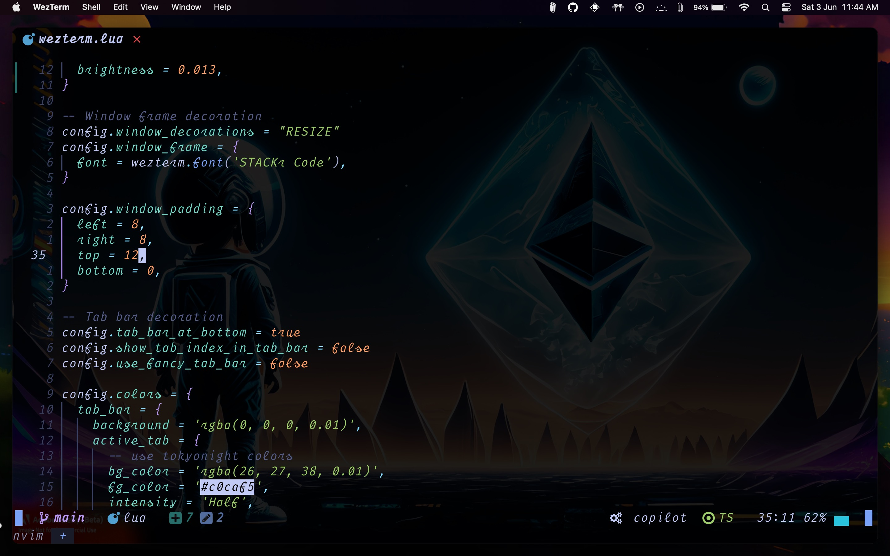

# My AstroVim Config 👾 



#### Clone the repository in your user config

```shell
git clone https://github.com/technophile-04/astrovim-config ~/.config/nvim/lua/user
```

#### Start Neovim

```shell
nvim
```
